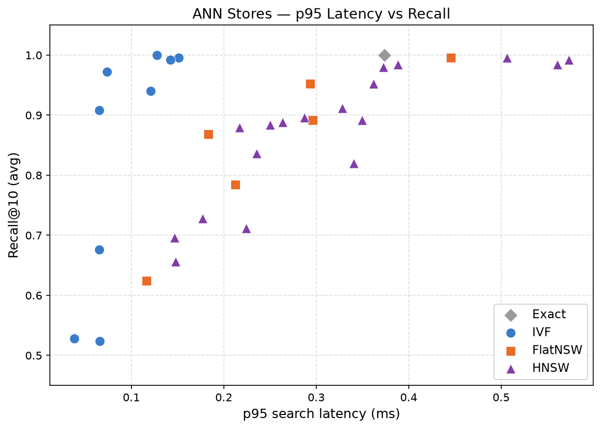
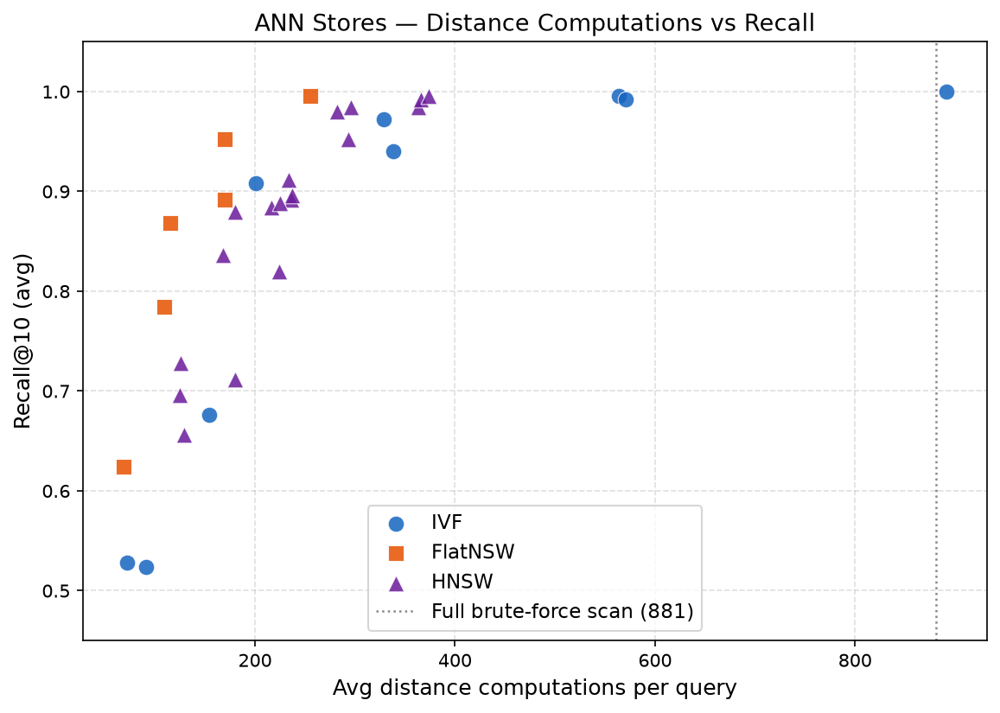
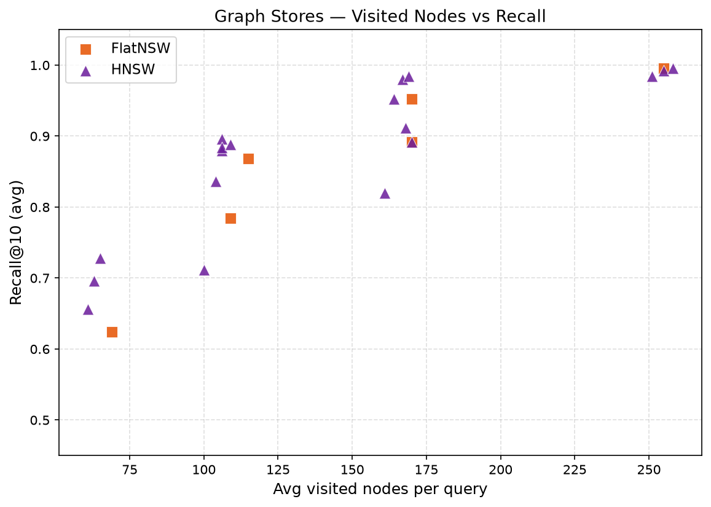
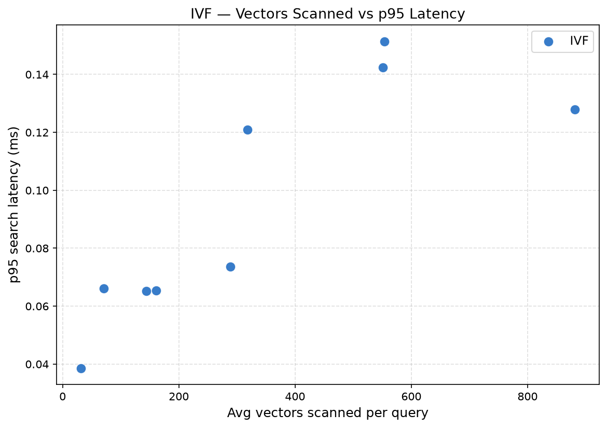
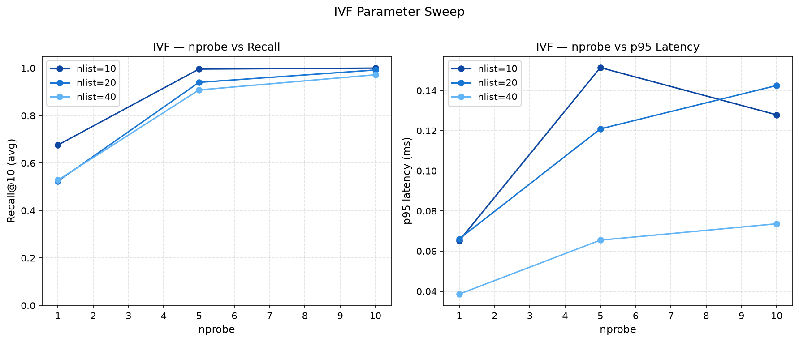
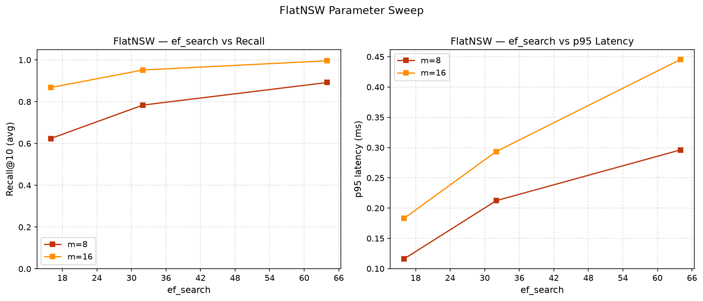
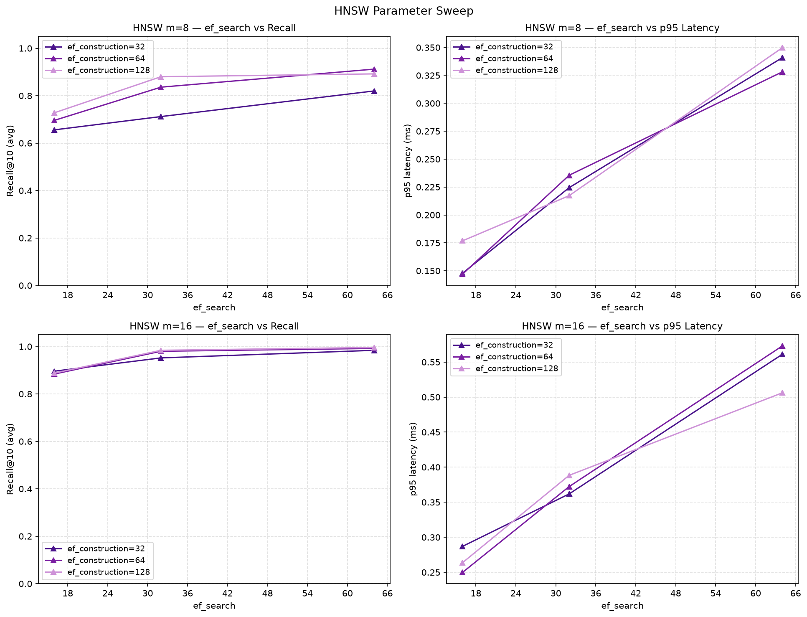
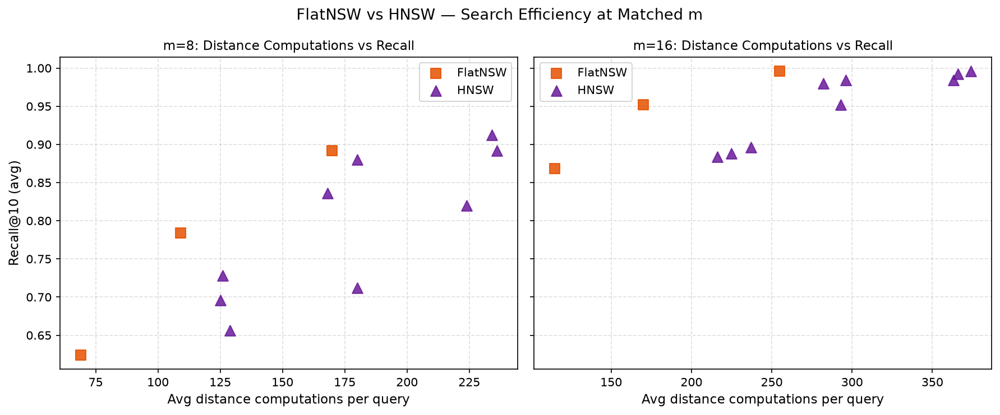

# ANN Visualizations

## Goal

Visualize the recall–latency–efficiency tradeoffs across three ANN store implementations: IVF, FlatNSW, and HNSW. The plots help answer:

- Which store gives the best recall at a given latency budget?
- How much compute (distance computations, visited nodes) does each store actually spend per query?
- How do individual parameters (nlist, nprobe, m, ef\_search, ef\_construction) control the recall–latency tradeoff?

## Input Benchmark

All plots consume:

```
benchmarks/results/pdf_ann_results_3.csv
```

This CSV is produced by the benchmark sweep defined in `docs/benchmarks.md`. It includes latency percentiles, recall averages, and per-query diagnostic averages (distance computations, visited nodes, graph hops, etc.) for every store configuration tested.

Run the visualization script from the project root:

```bash
poetry run python visualizations/visualize_ann_benchmark_results.py \
  --input-csv benchmarks/results/pdf_ann_results_3.csv \
  --output-dir visualizations/output
```

---

## Recall vs Latency



**x-axis:** p95 search latency (ms) — **y-axis:** recall@10 (avg)

The primary ANN tradeoff plot. Upper-left is better (high recall, low latency). IVF clusters in the low-latency region but recall varies widely with nprobe; at nprobe=1 recall drops below 0.7. FlatNSW and HNSW sit in the higher-latency region and can reach recall ≥ 0.99 with large enough ef\_search. The exact store appears as a single reference point at recall=1.0.

---

## Recall vs Distance Computations



**x-axis:** avg distance computations per query — **y-axis:** recall@10 (avg)

Measures how much raw compute each configuration spends to achieve a given recall. The vertical dashed line marks a full brute-force scan (881 vectors). IVF at nprobe=10 / nlist=10 reaches this line with recall=1.0, confirming it degrades to an exhaustive scan. FlatNSW and HNSW reach high recall at 170–370 distance computations — well below the brute-force ceiling — but their navigation overhead means they spend more compute than their visited-node count alone suggests.

---

## Recall vs Visited Nodes



**x-axis:** avg visited nodes per query — **y-axis:** recall@10 (avg)

Graph stores only (FlatNSW and HNSW). Visited nodes is the count of unique nodes added to the search's candidate set — a tighter measure of graph traversal work than total distance computations. For FlatNSW, visited nodes equals distance computations exactly (a structural property: every visited node gets scored immediately). For HNSW, visited nodes is consistently lower than distance computations because the greedy upper-layer descent adds extra scoring overhead on top of the bottom-layer candidate expansion.

---

## Latency vs Vectors Scanned



**x-axis:** avg vectors scanned per query — **y-axis:** p95 search latency (ms)

IVF only (flat\_nsw and hnsw scan 0 vectors in the IVF sense — they traverse graph edges instead). Shows the near-linear relationship between the number of candidate vectors fetched from probed clusters and p95 latency. Larger nprobe → more clusters → more vectors → higher latency. This confirms that IVF latency is dominated by the matrix multiplication over candidate vectors, not by centroid scoring.

---

## IVF Parameter Sweep



**Left:** nprobe vs recall for each nlist value. **Right:** nprobe vs p95 latency.

At nlist=10, recall rises steeply from nprobe=1 (0.68) to nprobe=10 (1.0) but nprobe=10 is a full scan of all 10 clusters, equivalent to brute force. Larger nlist values (20, 40) spread vectors across more clusters, so low nprobe returns worse recall — the target cluster is harder to find. To reach recall ≥ 0.97, nlist=20 requires nprobe≥5 and nlist=40 requires nprobe≥10. The latency curves confirm that per-query cost scales with nprobe regardless of nlist.

---

## FlatNSW Parameter Sweep



**Left:** ef\_search vs recall. **Right:** ef\_search vs p95 latency.

Larger m (more neighbors per node) gives better recall at the same ef\_search because the graph is better connected and candidates are more likely to propagate toward the true nearest neighbors. At ef\_search=64, m=16 reaches recall=0.996 vs 0.892 for m=8. The latency cost of higher m is visible on the right: m=16 is consistently slower to build (more edges) and slightly slower to search (larger neighbor lists to scan per hop).

---

## HNSW Parameter Sweep



**Rows:** m=8 (top) and m=16 (bottom). **Left column:** ef\_search vs recall. **Right column:** ef\_search vs p95 latency.

ef\_construction has a weak effect on recall at search time — increasing it from 32 to 128 adds only marginal recall gains at most ef\_search values, while making insert substantially slower. The dominant control on search quality is ef\_search. As with FlatNSW, m=16 uniformly outperforms m=8 on recall, and the latency penalty grows with both ef\_search and ef\_construction. At m=16 / ef\_search=64, HNSW approaches recall=0.996.

---

## FlatNSW vs HNSW — Search Efficiency



**x-axis:** avg distance computations per query — **y-axis:** recall@10 (avg). One panel per m value.

At 881 vectors, HNSW requires more distance computations than FlatNSW to reach comparable recall. The HNSW navigation overhead — scoring nodes in upper layers during the greedy descent before reaching the bottom layer — costs roughly 62–115 extra distance computations per query compared to FlatNSW at matched m and similar recall. This overhead is constant per m and independent of ef\_search, so it does not shrink as search quality improves. At small dataset scale the hierarchical structure provides no shortcut; FlatNSW's single-layer traversal is more compute-efficient.
