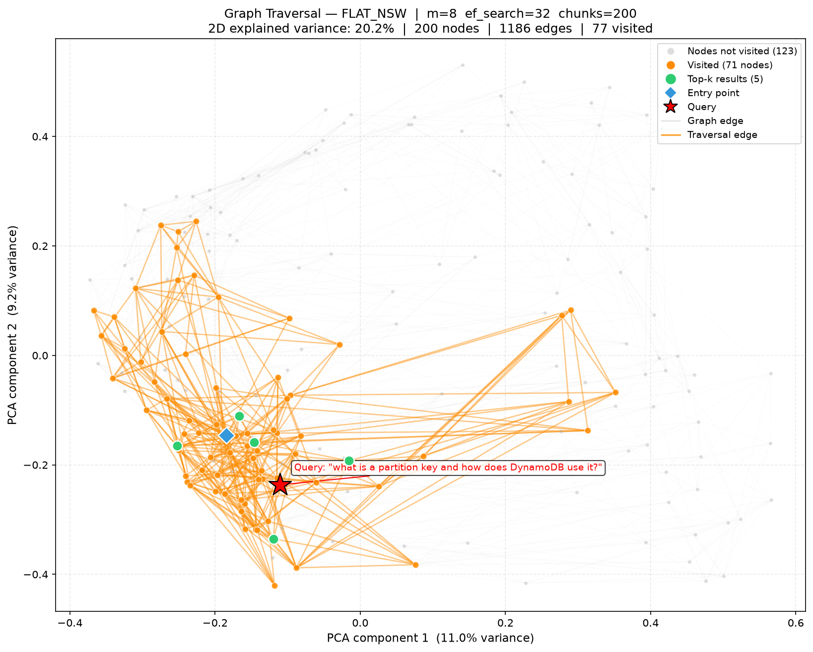
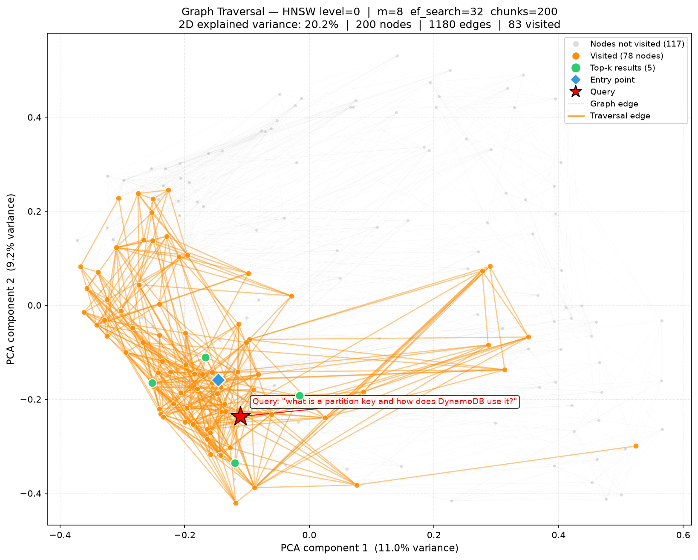
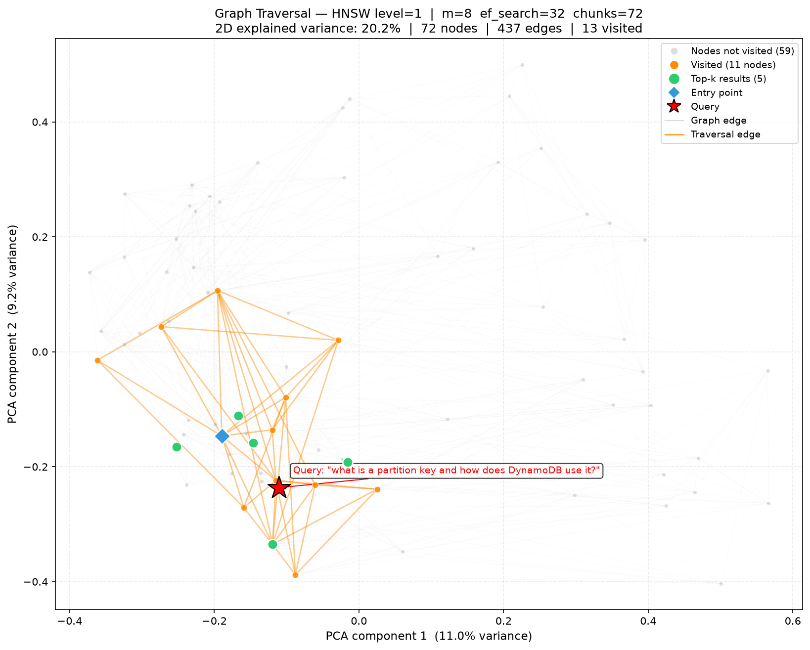

# Graph Traversal Visualization

## Goal

Show which nodes and edges a graph-based ANN search actually visits when answering a query.
The visualization answers:

- How much of the graph does a single search explore? (visited fraction)
- Are the top-k results reachable from the entry point via a tight traversal path?
- How does HNSW layer structure affect traversal density — is the base layer (level 0)
  much denser than upper layers?

All vectors are reduced to 2D via PCA for plotting. Sentence embeddings live in 384 dimensions,
so the 2D projection retains only ~20% of total variance. Cluster overlap in 2D does not imply
poor separation in the original space.

## Script

```
visualizations/visualize_graph_traversal.py
```

## Input

| Input | Description |
|---|---|
| `--store` | `flat_nsw` or `hnsw` |
| PDF file | Any PDF to index (`--pdf`) |
| Queries file | Plain text, one query per line (`--queries-file`) |
| `--query-index` | Which query to highlight (0-indexed) |
| `--top-k` | Number of results (default: 5) |
| `--max-chunks` | Limit PDF chunks indexed (default: 200; keeps graph readable) |
| `--m` | Graph degree parameter M (default: 8) |
| `--ef-search` | Candidate pool size at search time (default: 32) |
| `--ef-construction` | HNSW only — candidate pool size at build time (default: 64) |
| `--level` | HNSW only — which layer to draw edges and nodes for (default: 0) |

## Run

```bash
# FlatNSW
poetry run python visualizations/visualize_graph_traversal.py \
  --store flat_nsw \
  --pdf The_DynamoDb_Book.pdf \
  --queries-file visualizations/queries.txt \
  --query-index 0 \
  --max-chunks 200

# HNSW base layer (level 0)
poetry run python visualizations/visualize_graph_traversal.py \
  --store hnsw \
  --pdf The_DynamoDb_Book.pdf \
  --queries-file visualizations/queries.txt \
  --query-index 0 \
  --max-chunks 200 \
  --level 0

# HNSW upper layer (level 1 — sparser, shows greedy-descent structure)
poetry run python visualizations/visualize_graph_traversal.py \
  --store hnsw \
  --pdf The_DynamoDb_Book.pdf \
  --queries-file visualizations/queries.txt \
  --query-index 0 \
  --max-chunks 200 \
  --level 1
```

Output filenames encode key parameters so multiple runs coexist:

```
graph_{store}_m{M}_ef{ef_search}_chunks{N}[_lvl{L}]_q{Q}.png
```

To override:

```bash
poetry run python visualizations/visualize_graph_traversal.py \
  --store hnsw \
  --pdf The_DynamoDb_Book.pdf \
  --queries-file visualizations/queries.txt \
  --output-path visualizations/output/graph_traversal/custom_name.png
```

## Visual Legend

| Element | Appearance | Meaning |
|---|---|---|
| Small gray dots | Light gray, low alpha | Nodes not visited during this search |
| Larger orange dots | Orange, medium alpha | Nodes visited (explored) during search |
| Larger green dots | Green, white edge | Top-k result nodes |
| Blue diamond `◆` | Blue, white edge | Entry point (search starts here) |
| Red star `★` | Red, black edge | Query vector (projected to 2D) |
| Faint gray lines | Very low alpha | All graph edges at this layer |
| Orange lines | Medium alpha | Traversal edges (both endpoints visited) |

**How traversal is tracked:** A new opt-in field `visited_node_ids: list[str] | None` was
added to `SearchDiagnostics`. Normal search paths leave it `None` (zero overhead). The
visualization script opts in by passing `SearchDiagnostics(visited_node_ids=[])` to the
internal helper methods, which append each node ID as it is added to the visited set.

---

## Sample Outputs

### FlatNSW — Query: "what is a partition key and how does DynamoDB use it?"

```
--store flat_nsw --max-chunks 200 --m 8 --ef-search 32 --query-index 0
200 nodes · 800 edges · 77 nodes visited (38.5%)
```



FlatNSW is a single-layer graph. The search starts at the entry point (blue diamond) and
expands outward via the beam search (ef_search=32). Orange nodes show the explored region;
traversal edges connect visited neighbors. The 5 top-k results (green) sit within the visited
subgraph — the search reached them via the graph connectivity. 38.5% of all nodes were visited,
reflecting the ef_search=32 candidate pool limiting expansion after the beam fills.

---

### HNSW Level 0 — Query: "what is a partition key and how does DynamoDB use it?"

```
--store hnsw --max-chunks 200 --m 8 --ef-search 32 --level 0 --query-index 0
200 nodes · 1169 edges · 92 unique nodes visited
```



HNSW level 0 is the densest layer — every node participates and has up to M=8 bidirectional
links, giving 1169 edges versus FlatNSW's 800. The search first descends greedily through upper
layers to find a good entry candidate, then runs a wider ef_search=32 beam at level 0. The
visited count (92) is slightly higher than FlatNSW (77) because HNSW's greedy descent through
levels 1–5 adds extra nodes to `visited_node_ids` before the base-layer beam even starts.

---

### HNSW Level 1 — Query: "what is a partition key and how does DynamoDB use it?"

```
--store hnsw --max-chunks 200 --m 8 --ef-search 32 --level 1 --query-index 0
80 nodes at level 1 · 475 edges · 88 nodes in visited_node_ids
```



Level 1 is sparser — only ~40% of the 200 nodes are promoted here, and edges show the
long-range shortcuts that make upper-layer greedy descent fast. `visited_node_ids` at this
level captures all nodes scored during the full search (greedy descent across all levels +
base-layer beam), so the visited count appears large relative to the layer. The greedy path
through level 1 typically touches only a handful of nodes (following the best neighbor each
step), but the base-layer beam dominates the total count. The sparse long-range structure
explains why HNSW's greedy descent converges quickly — upper-layer edges span large distances
in embedding space.
