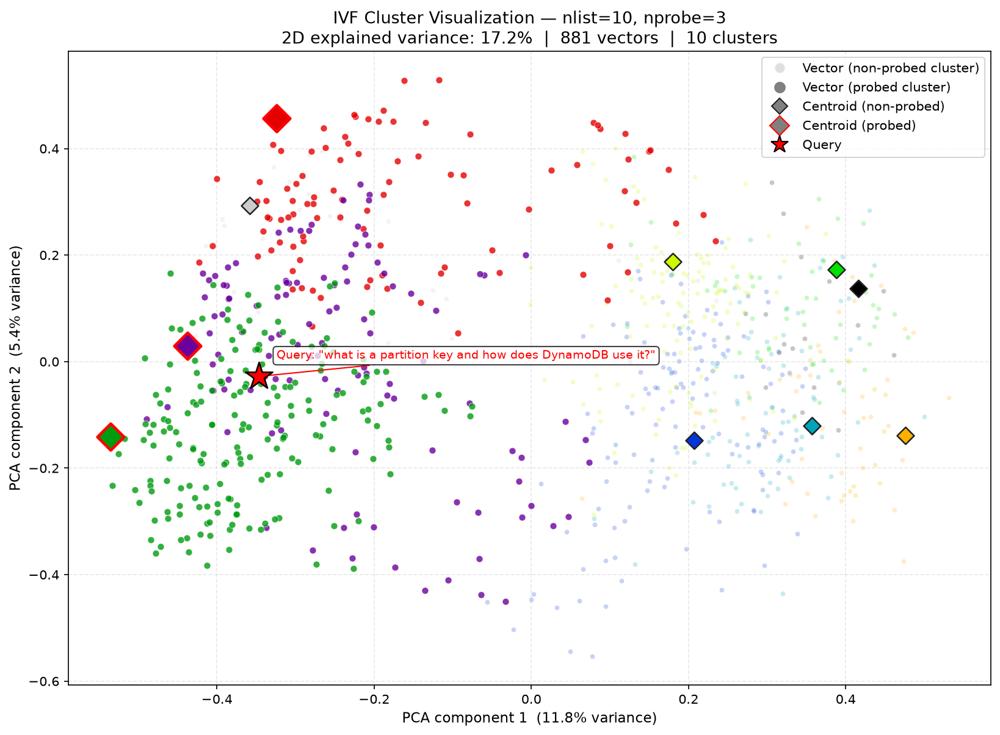
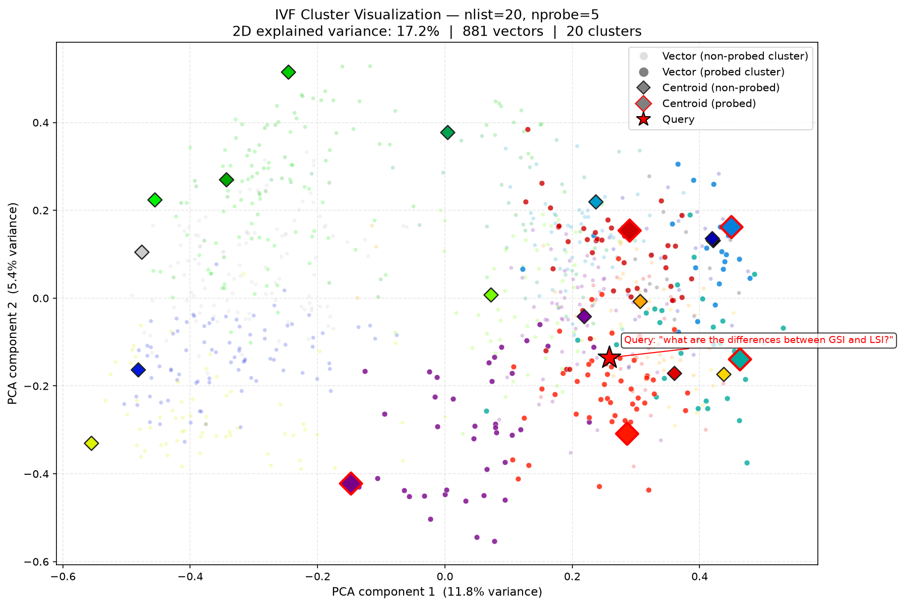

# IVF Cluster Visualization

## Goal

Show how IVF partitions a vector space and which clusters a given query probes.
The visualization answers:

- How well does KMeans separate the embedding space into distinct regions?
- Which clusters does a query land near, and how spread out are they?
- Does the 2D PCA projection reveal any meaningful structure (topic groupings, overlap)?

All vectors and centroids are reduced to 2D using PCA for plotting. Because
sentence embeddings live in 384 dimensions, the 2D projection retains only
~15–20% of total variance — cluster boundaries will overlap in 2D even when
they are well-separated in the original space. The explained variance is
annotated on the plot axes.

## Script

```
visualizations/visualize_ivf_clusters.py
```

## Input

| Input | Description |
|---|---|
| PDF file | Any PDF to index (e.g. `The_DynamoDb_Book.pdf`) |
| Queries file | Plain text file, one query per line (`visualizations/queries.txt`) |
| `--query-index` | Which line from the queries file to highlight |
| `--nlist` | Number of KMeans clusters to build |
| `--nprobe` | Number of clusters the query probes |

## Run

```bash
poetry run python visualizations/visualize_ivf_clusters.py \
  --pdf The_DynamoDb_Book.pdf \
  --queries-file visualizations/queries.txt \
  --query-index 0 \
  --nlist 10 \
  --nprobe 3
```

Output is saved to `visualizations/output/ivf_clusters/` by default.
The filename encodes the key parameters so multiple runs coexist:

```
ivf_clusters_nlist{N}_nprobe{P}_q{Q}.png
```

To override the output path:

```bash
poetry run python visualizations/visualize_ivf_clusters.py \
  --pdf The_DynamoDb_Book.pdf \
  --queries-file visualizations/queries.txt \
  --output-path visualizations/output/ivf_clusters/custom_name.png
```

## Visual Legend

| Element | Appearance | Meaning |
|---|---|---|
| Small faint dots | Cluster colour, low alpha | Chunk vectors in non-probed clusters |
| Larger vivid dots | Cluster colour, high alpha | Chunk vectors in probed clusters |
| Small diamond `◆` | Cluster colour, dark edge | Centroid of a non-probed cluster |
| Large diamond `◆` | Cluster colour, **red edge** | Centroid of a probed cluster |
| Red star `★` | Red, black edge | Query vector |

---

## Sample Output

### nlist=10, nprobe=3 — Query: "what is a partition key and how does DynamoDB use it?"



3 out of 10 clusters are probed (probed cluster IDs: 1, 4, 8). The query lands
near the centroids of those three clusters, which capture the partition-key and
key-design regions of the embedding space. Non-probed cluster vectors are dimmed
to make the probed region stand out. The 2D explained variance (~17%) means
cluster overlap in this projection is expected and does not imply poor separation
in the full 384-dimensional space.

---

### nlist=20, nprobe=5 — Query: "what are the differences between GSI and LSI?"



With nlist=20 the space is divided more finely — clusters are smaller and more
numerous. The query probes 5 clusters (IDs: 1, 5, 7, 16, 18), which are spread
across different regions of the 2D projection. This reflects the fact that
GSI/LSI content is discussed across multiple sections of the PDF and its
embeddings cluster into non-adjacent groups. Increasing nprobe captures more of
this dispersed signal at the cost of scanning more vectors per query.
