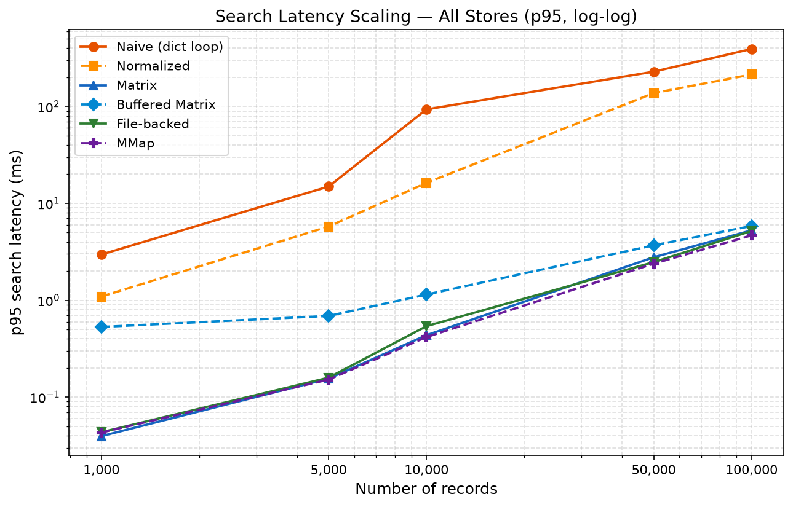
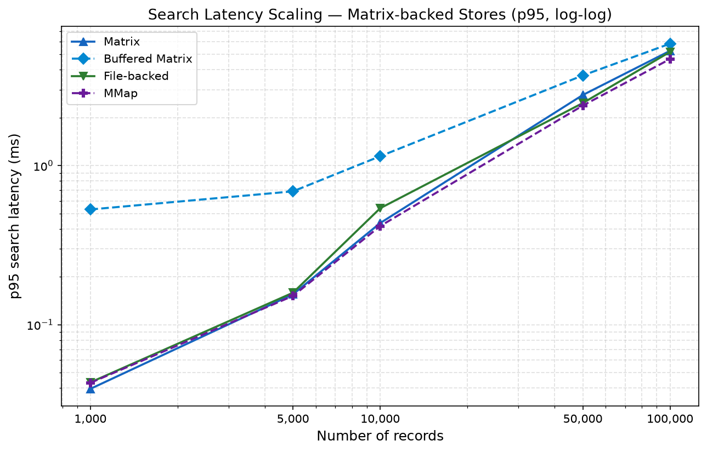

# Store Latency Scaling — Visualizations

## Goal

Show how p95 search latency grows with the number of stored records across all six exact
store implementations. The plots answer:

- Do all stores scale the same way with N?
- How large is the gap between Python-loop stores and matrix-backed stores?
- Among matrix-backed stores, which is fastest and by how much?

## Input Data

```
benchmarks/results/store_latency_scaling.csv
```

Produced by running `benchmark_store.py` in checkpoint mode (see
[../benchmarks/vector_store_benchmarks.md](../benchmarks/vector_store_benchmarks.md)).
Each row is a `(store, checkpoint)` pair with search latency metrics from 1,000 queries.

Run the visualization script from the project root:

```bash
poetry run python visualizations/visualize_store_latency_scaling.py \
  --input-csv benchmarks/results/store_latency_scaling.csv \
  --output-dir visualizations/output/store_latency_scaling
```

---

## All Stores — p95 Latency vs Record Count



Both axes are log-scale. The chart covers checkpoints at 1k, 5k, 10k, 50k, and 100k
records (384 dimensions, 1,000 queries, top-k 5).

The two store families are immediately visible: `naive` and `normalized` sit orders of
magnitude above the matrix-backed group. At 100k records, `naive` hits ~392ms p95 while
`mmap` sits at ~4.7ms — an 83× gap — despite both scanning the same 100k vectors per query.
The difference is Python loop overhead vs a single BLAS matrix multiply.

All stores grow roughly linearly on this log-log plot, confirming O(N) search scaling
for every implementation.

---

## Matrix-backed Stores — p95 Latency vs Record Count (zoomed)



The same log-log chart restricted to `matrix`, `buffered-matrix`, `file`, and `mmap`.
At this zoom level the differences between the four stores become visible.

`matrix`, `file`, and `mmap` track each other closely across all checkpoints — all three
present a clean, fully-flushed matrix to each query. `buffered-matrix` sits higher at
small checkpoints because unflushed buffer records require an extra vstack and matrix
multiply on every search call; the gap narrows as the flushed matrix grows to dominate
the buffer fraction.
